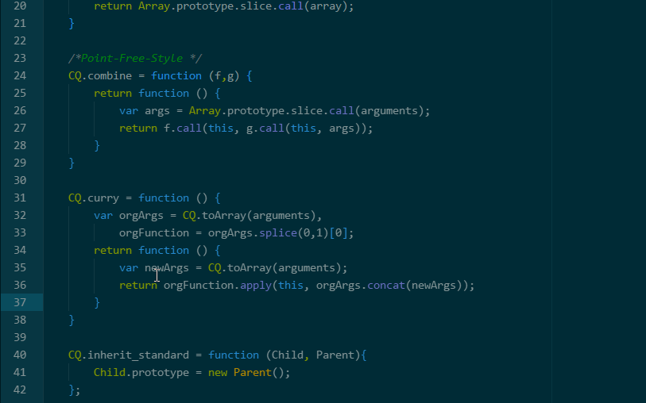

# block-comment-lines package
Puts the selected lines in a block-comment or removes it by toggling. To remove the comment just place cursor inside comment.
Besides document language this package also identifies embedded languages.
The block comment definition for languages not yet supported is /\*....\*/.
Supported languages are:
- JavaScript
- HTML
- CSS
- CoffeeScript
- Java
- C, C++, C#
- PHP

